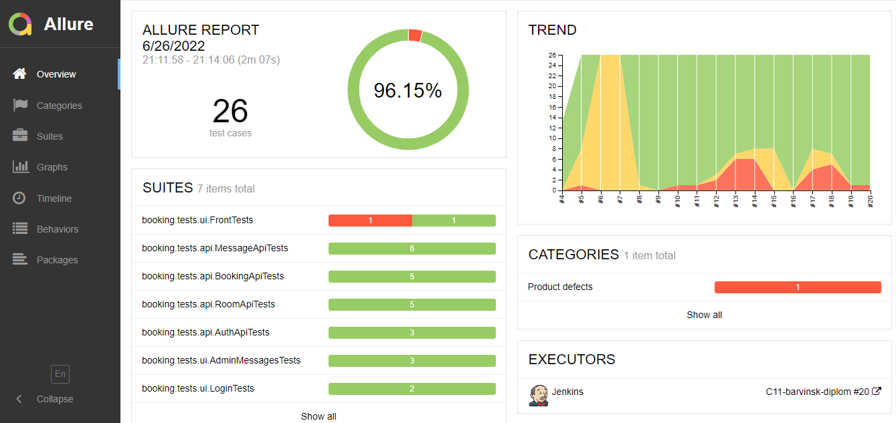
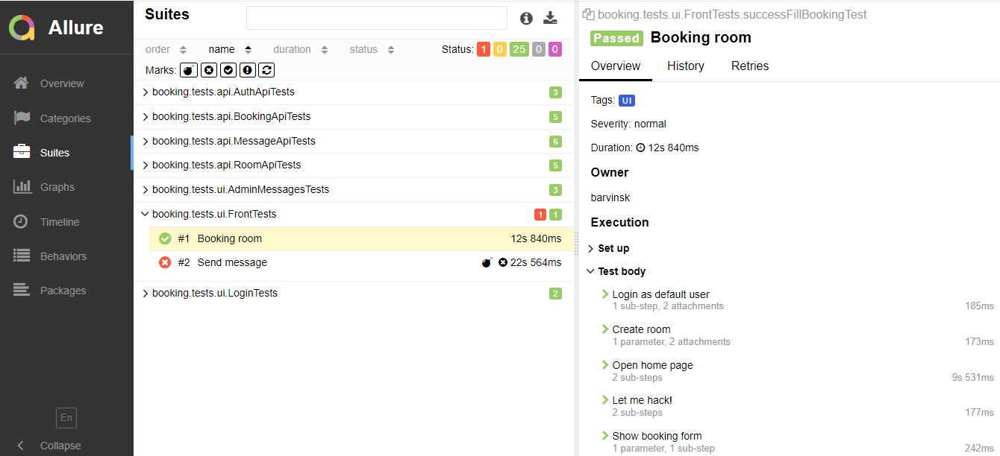
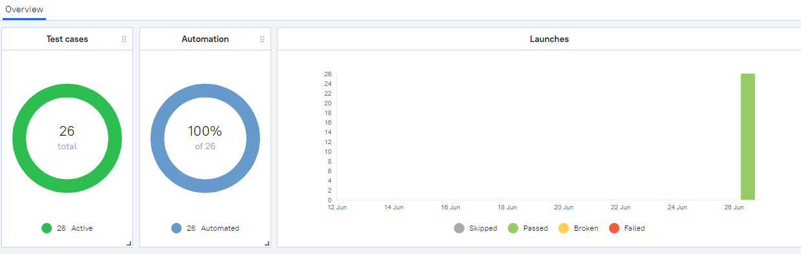
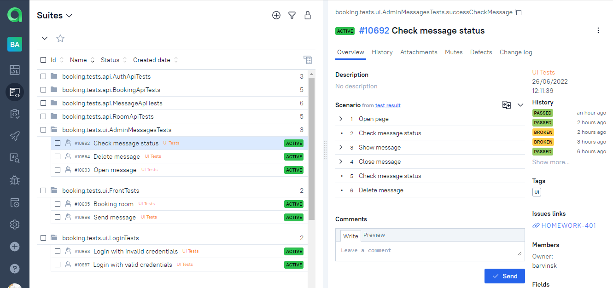
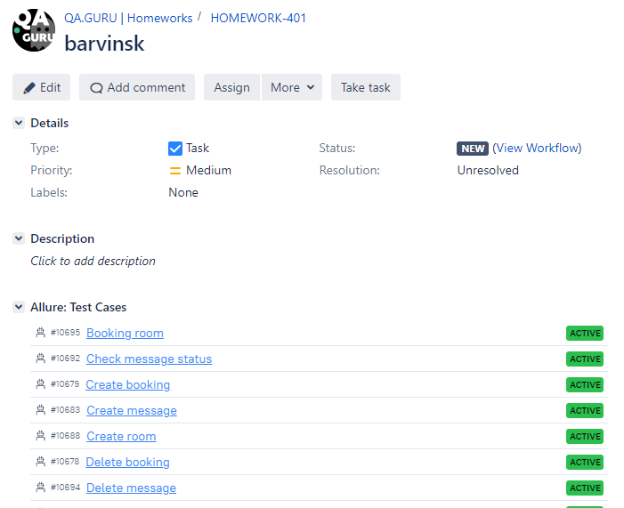
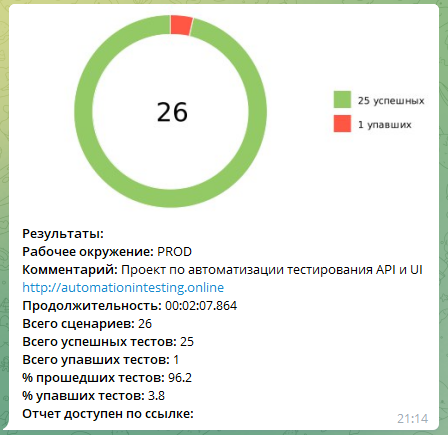

# Проект по автоматизации тестирования системы бронирования
https://automationintesting.online/#/

## Содержание:
- <a href="#технологии-и-инструменты">Технологии и инструменты</a>
- <a href="#реализованные-проверки">Реализованные проверки</a>
- <a href="#сборка-в-Jenkins">Сборка в Jenkins</a>
- <a href="#запуск-из-терминала">Запуск из терминала</a>
- <a href="#allure-отчет">Allure отчет</a>
- <a href="#allure-testops">Allure TestOps</a>
- <a href="#интеграция-с-jira">Интеграция с Jira</a>
- <a href="#отчет-в-telegram">Отчет в Telegram</a>
- <a href="#film_projector-видео-примеры-прохождения-тестов">Видео примеры прохождения тестов</a>

## Технологии и инструменты
<p align="center">


</p>

## Реализованные проверки
#### UI тесты:
- [x] Бронирование комнаты
- [x] Отправка формы обратной связи
- [x] Авторизация в панели администратора
- [x] Управление сообщениями, которые были направлены с формы обратной связи

#### API тесты:
- [x] Аутентификация
- [x] Управление комнатами
- [x] Управление бронированием команты
- [x] Управление сообщениями, которые были направлены с формы обратной связи

## Сборка в Jenkins
### <a target="_blank" href="https://jenkins.autotests.cloud/job/C11-barvinsk-diplom/">Сборка в Jenkins</a>
<p align="center">

</p>

### Параметры сборки в Jenkins:
Сборка в Jenkins
- webUrl 
- apiUrl
- defaultLogin
- defaultPassword
- browser
- browserVersion
- browserSize
- remoteDriverUrl (адрес selenoid)
- videoStorage (адрес хранилища видео прохождения кейсов)
- threads (количество потоков, по умолчанию 5)

## Запуск из терминала
Локальный запуск:
```
gradle clean test
```

Удаленный запуск:
```
clean
test
-DwebUrl=${WEB_URL}
-DapiUrl=${API_URL}
-DdefaultLogin=${LOGIN}
-DdefaultPassword=${PASSWORD}
-Dbrowser=${BROWSER}
-DbrowserVersion=${BROWSER_VERSION}
-DbrowserSize=${BROWSER_SIZE}
-DremoteDriverUrl=${REMOTE_DRIVER_URL}
-DvideoStorage=${VIDEO_STORAGE}
-Dthreads=${THREADS}
```

## Allure отчет
- ### Главный экран отчета
<p align="center">

</p>

- ### Страница с проведенными тестами
<p align="center">

</p>

## Allure TestOps
- ### Экран с результатами запуска тестов
<p align="center">

</p>

- ### Страница с тестами в TestOps
<p align="center">

</p>

## Интеграция с Jira
- ### Страница с задачей в Jira
<p align="center">

</p>

## Отчет в Telegram
<p align="center">

</p>

## Видео примеры прохождения тестов
> К каждому тесту в отчете прилагается видео. Одно из таких видео представлено ниже.
<p align="center">
  
</p>