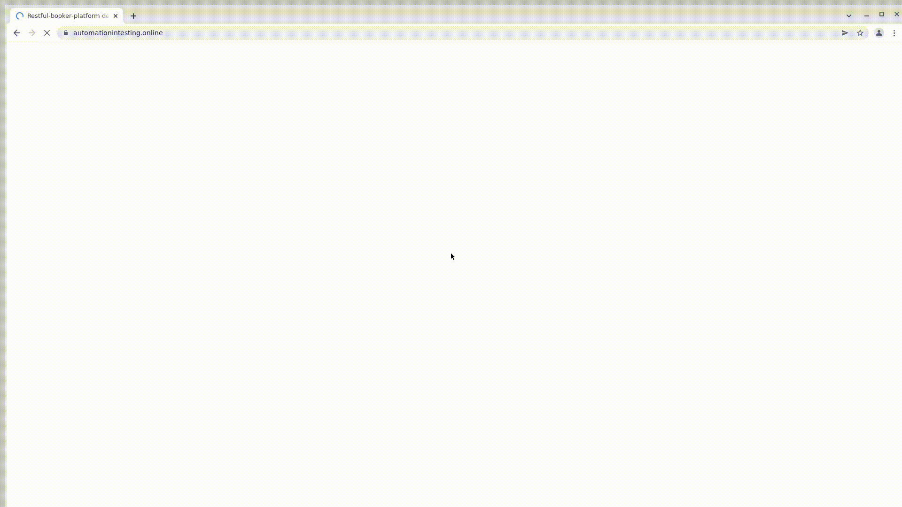

# Проект по автоматизации тестирования системы бронирования
https://automationintesting.online/#/

## :floppy_disk: Содержание:
- <a href="#computer-технологии-и-инструменты">Технологии и инструменты</a>
- <a href="#notebook_with_decorative_cover-реализованные-проверки">Реализованные проверки</a>
- <a href="#electric_plug-сборка-в-Jenkins">Сборка в Jenkins</a>
- <a href="#arrow_forward-запуск-из-терминала">Запуск из терминала</a>
- <a href="#open_book-allure-отчет">Allure отчет</a>
- <a href="#open_book-allure-отчет">Allure TestOps</a>
- <a href="#robot-отчет-в-telegram">Отчет в Telegram</a>
- <a href="#film_projector-видео-примеры-прохождения-тестов">Видео примеры прохождения тестов</a>

## :computer: Технологии и инструменты
<p align="center">


</p>

## :notebook_with_decorative_cover: Реализованные проверки
#### UI тесты:
- [✓] Бронирование комнаты
- [✓] Отправка формы обратной связи
- [✓] Авторизация в панели администратора
- [✓] Управление сообщениями, которые были направлены с формы обратной связи

#### API тесты:
- [✓] Аутентификация
- [✓] Управление комнатами
- [✓] Управление бронированием команты
- [✓] Управление сообщениями, которые были направлены с формы обратной связи

## :electric_plug: Сборка в Jenkins
### <a target="_blank" href="https://jenkins.autotests.cloud/job/C11-barvinsk-diplom/">Сборка в Jenkins</a>
<p align="center">

</p>

### Параметры сборки в Jenkins:
Сборка в Jenkins
- webUrl 
- apiUrl
- defaultLogin
- defaultPassword
- browser
- browserVersion
- browserSize
- remoteDriverUrl (адрес selenoid)
- videoStorage (адрес хранилища видео прохождения кейсов)
- threads (количество потоков, по умолчанию 5)

## :arrow_forward: Запуск из терминала
Локальный запуск:
```
gradle clean test
```

Удаленный запуск:
```
clean
test
-DwebUrl=${WEB_URL}
-DapiUrl=${API_URL}
-DdefaultLogin=${LOGIN}
-DdefaultPassword=${PASSWORD}
-Dbrowser=${BROWSER}
-DbrowserVersion=${BROWSER_VERSION}
-DbrowserSize=${BROWSER_SIZE}
-DremoteDriverUrl=${REMOTE_DRIVER_URL}
-DvideoStorage=${VIDEO_STORAGE}
-Dthreads=${THREADS}
```

## :open_book-allure: Allure отчет
- ### Главный экран отчета
<p align="center">

</p>

- ### Страница с проведенными тестами
<p align="center">

</p>

## :open_book-allure: Allure TestOps
- ### Экран с результатами запуска тестов
<p align="center">

</p>

- ### Страница с тестами в TestOps
<p align="center">

</p>

## :point_up_2: Интеграция с Jira
- ### Страница с задачей в Jira
<p align="center">

</p>

## :robot: Отчет в Telegram
<p align="center">

</p>

## :film_projector: Видео примеры прохождения тестов
> К каждому тесту в отчете прилагается видео. Одно из таких видео представлено ниже.
<p align="center">
  
</p>